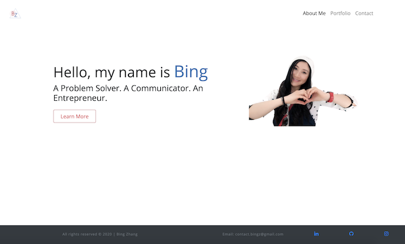
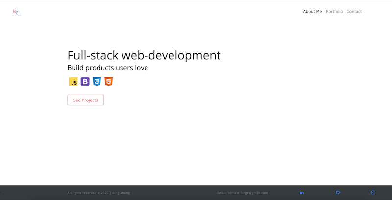
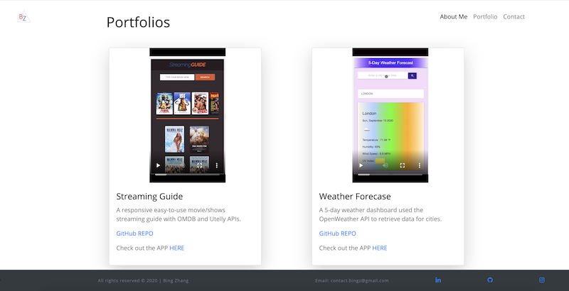
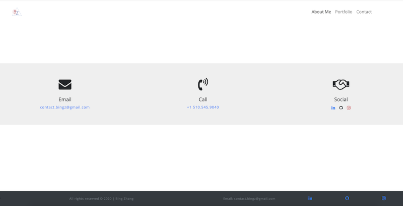

# Responsive-Website-Portfolio

## Table of Content
1. [ Project Context ](#context)
2. [ Project Objectives ](#objectives)
3. [ Tools Used ](#tools)
4. [ Project Links ](#Links)
5. [ Screenshots ](#Screenshots)
6. [ Installation](#Installation)
7. [ Credits](#Credits)
8. [What I've Learned](#learned)
9. [ License ](#License)

### 1. Project Context
A website that will showcase my future projects along with information about myself.

### 2. Project Objectives
 * Use Bootstrap4 to build a mobile-first responsive personal Website without using media query. 
 * Use Bootstrap4 to make a sticky footer 
 * Apply Bootstrap4 sub-rows and sub-columns 

### 3. This website uses HTML5, CSS3 and Bootstrap4
* It is optimized for SEO and ARIA accessibility 
* It is responsive to different screen sizes of devices such as mobile, tablet, and desktop.
* It is NOT optimized for extreme large screens such as Apple iMac 27

### 4. Link - Project Website
 https://imbingz.github.io/Responsive-Website-Portfolio/

### Link - Project files 
https://github.com/imbingz/Responsive-Website-Portfolio

### 5. Screenshots 

####  Screenshots - Laptop view 

#### Screenshots - Mobile View

### 6. Installation
* Access to GitHub.com and a code editor such as vscode is necessary
* Go to [github.com/imbingz/imbingz.github.io.](https://github.com/imbingz/Responsive-Website-Portfolio)
* Click on the green button that says Clone or Download
* Choose how you would like to download: using the SSH/HTTPS keys or download the zip file
* Using SSH/HTTPS Key: You will copy the link shown and open up either terminal (mac: pre-installed) or gitbash (pc: must be installed). Once the application is open, you will type git clone paste url here. Once you have cloned the git repo, cd into the repo and type open. to open the folder which contains all files used for the website. Once inside the folder, click on index.html to open the website in the browser.
* Using Download ZIP: Click on Download Zip. Locate the file and double click it to unzip the file. Locate the unzipped folder and and open it. All the files for the website will be within this folder. Click on index.html to open the website in the browser.

### 7. Credits:
* [getbootstrap.com](https://getbootstrap.com/docs/4.0/getting-started/introduction/)
* [favicon-generator.org](https://www.favicon-generator.org/)
* [fonts.google.com](https://fonts.google.com/)
* [Free icons-fontawesome.com](https://fontawesome.com/v4.7.0/get-started/)
* [Free icons-icon8.com](https://icons8.com/)
* [Free photos-unsplash.com](https://unsplash.com/)
* [YouTube-Bootstrap Video](https://youtu.be/zhllkjYYUVE)
* [YouTube-UI Design Fundamentals](https://youtu.be/tRpoI6vkqLs)
* [Inspiration-behance.net](https://www.behance.net/collection/178220473/Portfolio-website)
* [Inspiration-canva.com](https://www.canva.com)
* [Inspiration-cobidev.com](https://cobidev.com/)
* [User-Journey v.s User-flow](https://xd.adobe.com/ideas/process/user-research/user-journey-vs-user-flow/)
* [Typographic Web design](http://www.typographicwebdesign.com/setting-text/font-size-line-height-measure-alignment/#:~:text=Line%20height%20controls%20the%20amount,like%20a%20tightly%20woven%20fabric)
* [How to write README](https://github.com/matiassingers/awesome-readme)
* [Code validator](https://validator.w3.org/)

### 8. What I've Learned
* It needs more than just clean codes to achieve a beautiful website. After learning how to build the components like navbar, cards and forms etc., how large or small should they be, and where best shall I place them to optimize user experience and interactions?   Thankfully there are great resources out there on this topic, which helped me enormously. 

* Deploy the website on Github page from the beginning so that I can check my codes on the code validator (listed in credit) often throughout the project. I did not do that until the very last. Although I had spent hours to look for errors, open element through my project, code validator showed me 16 initial errors from missing tags, to wrong or unnecessary ARIA labels. It could have saved me a lot of time had I checked my codes earlier. 

* Practice! Practice! Practice! I know it is cliche; it is the undebatable fact! I watched hours of Youtube tutorials on how to build responsive mobile-first website with Bootstrap and felt confident that I got this until I started to code myself. The codes I copied line by line from Youtube tutorial diid not achieve the same outcomes as the videos showed and it is great learning process to figure out why. Google is truly my BEST friend now.  

### 9. License

##### MIT License

Copyright (c) [2020] [bingzhang]

Permission is hereby granted, free of charge, to any person obtaining a copy of this software and associated documentation files (the "Software"), to deal in the Software without restriction, including without limitation the rights to use, copy, modify, merge, publish, distribute, sublicense, and/or sell copies of the Software, and to permit persons to whom the Software is furnished to do so, subject to the following conditions:

The above copyright notice and this permission notice shall be included in all copies or substantial portions of the Software.

THE SOFTWARE IS PROVIDED "AS IS", WITHOUT WARRANTY OF ANY KIND, EXPRESS OR IMPLIED, INCLUDING BUT NOT LIMITED TO THE WARRANTIES OF MERCHANTABILITY, FITNESS FOR A PARTICULAR PURPOSE AND NONINFRINGEMENT. IN NO EVENT SHALL THE AUTHORS OR COPYRIGHT HOLDERS BE LIABLE FOR ANY CLAIM, DAMAGES OR OTHER LIABILITY, WHETHER IN AN ACTION OF CONTRACT, TORT OR OTHERWISE, ARISING FROM, OUT OF OR IN CONNECTION WITH THE SOFTWARE OR THE USE OR OTHER DEALINGS IN THE SOFTWARE.

